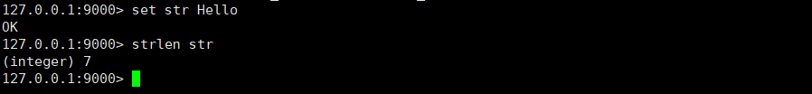
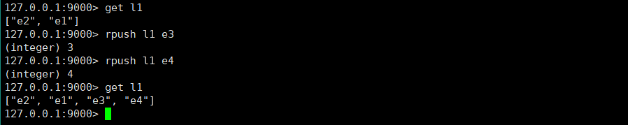

# SmallRedis

## 简介

技术支持：C++、 CMake、 C/S 模式、 Linux 环境、 RPC 框架、 跳表等。

功能： 

- 自定义字符串、列表、哈希表等多种值类型； 

- 跳表实现数据库底层数据结构； 

- 包含近 30 种操作命令如 select、set、 get、 mset、 incr、 rpush、 hset 等； 

- 可自由切换不同序号数据库； 

- 数据持久化至文件以及从文件中解析数据。  

## 编译启动

编译，依次执行以下Linux命令

```txt
mkdir build
cd build
cmake ..
make
```

项目目录结构，编译后


bin目录


build目录


data_files目录（测试后补）


src目录


启动，依次执行以下Linux命令

```txt
// 跳转至项目根目录
cd ..
// 启动server服务端
./bin/server
// 启动client服务端
./bin/client
```

server服务端启动


client客户端启动


## 测试命令

### 常规命令

#### select

切换数据库， 0-15

```c++
set k0 v0
select 10
set k10 v10
select 0
get k0
```


#### keys

获取全部key

```c++
set k00 v00
keys *
```


#### dbsize

```c++
dbsize
```


#### exists

```c++
exists k0
exists k000
```


#### del

```c++
del k0 k00
```


#### rename

```c++
set k0 v0
get k0
rename k0 key0
get k0
get key0
```


#### exit

```txt
exit  // 退出客户端
```


### 字符串命令

#### set

```txt
select 2
keys *
set k1 v1  // 默认，不存在则添加，存在则覆盖
set k1 v1 NX  // 存在则报错
set k2 v2 NX  // 不存在则添加
set k3 v3 XX  // 不存在则报错
set k1 v11 XX  // 存在则覆盖
```


#### setnx

```txt
setnx k6 v6
setnx k6 v6
```


#### setex

```c++
setex k7 v7
setex k6 v66
get k6
```


#### get

```c++
get k6
```


#### incr

```c++
set num 5
incr num
```


#### incrby

```c++
get num
incrby num 3
```


#### incrbyfloat

```c++
set fnum 3.14
get fnum
incrbyfloat fnum 0.6
```


#### decr

```c++
get num
decr num
```


#### decrby

```c++
get num
decrby num 4
```


#### mset

```txt
select 3
keys *
mset k1 v1 k2 v2 k3 v3
get k1
get k2
get k3
```


#### mget

```c++
mget k1 k2 k3
```


#### strlen

```c++
set str Hello
strlen str
```



不太对，前后字符也算上了

#### append

```c++
append str China
get str
```


### 列表命令

#### lpush

```txt
select 5
keys *
lpush l1 e1
lpush l1 e2
get l1
```


#### rpush

```txt
get l1
rpush l1 e3
rpush l1 e4
get l1
```



#### lpop

```txt
get l1
lpop l1
get l1
```


#### rpop

```txt
get l1
rpop l1
get l1
```


#### lrange

```txt
rpush l2 e1
rpush l2 e2
rpush l2 e3
rpush l2 e4
rpush l2 e5
rpush l2 e6
lrange l2 1 4
```


### 哈希表命令

#### hset

```txt
select 8
keys *
hset h1 name zhangsan
get h1
```


#### hget

```c++
hget h1 name
```


#### hdel

```txt
get h1
hset h1 age 22
hset h1 sex male
get h1
hdel h1 age
get h1
```


#### hkeys

```c++
get h1
hkeys h1
```


#### hvals

```c++
get h1
hvals h1
```


## 参考

```c++
跳表: https://leetcode.cn/problems/design-skiplist/description/
TinyRedis: https://github.com/zk1556/TinyRedis_RPC
```

# End


